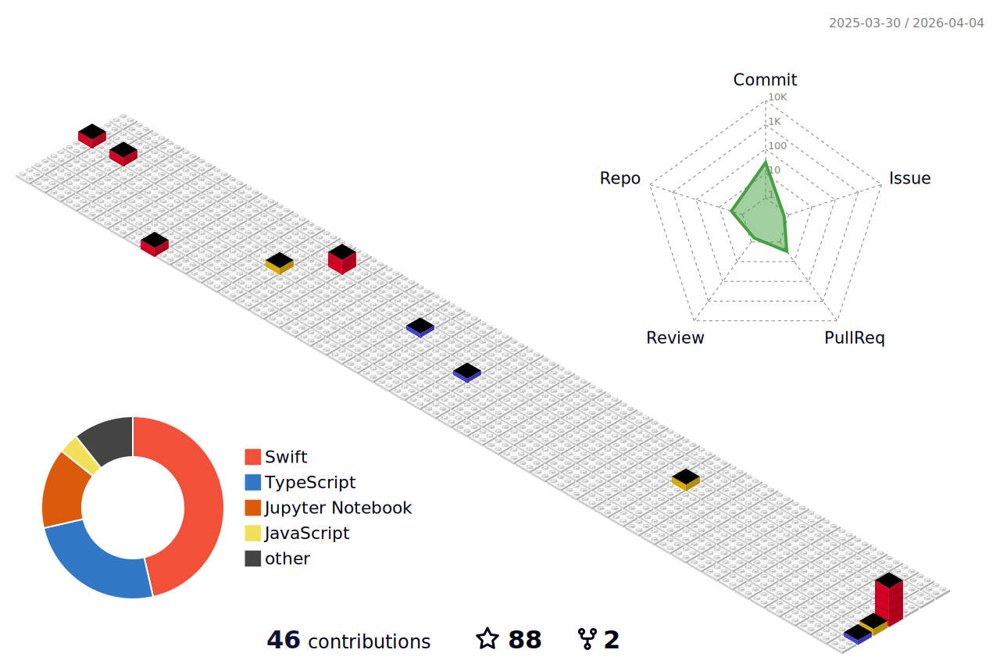
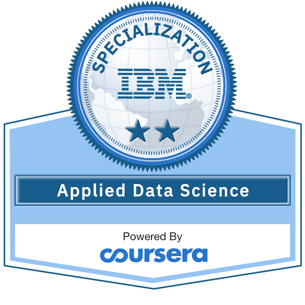
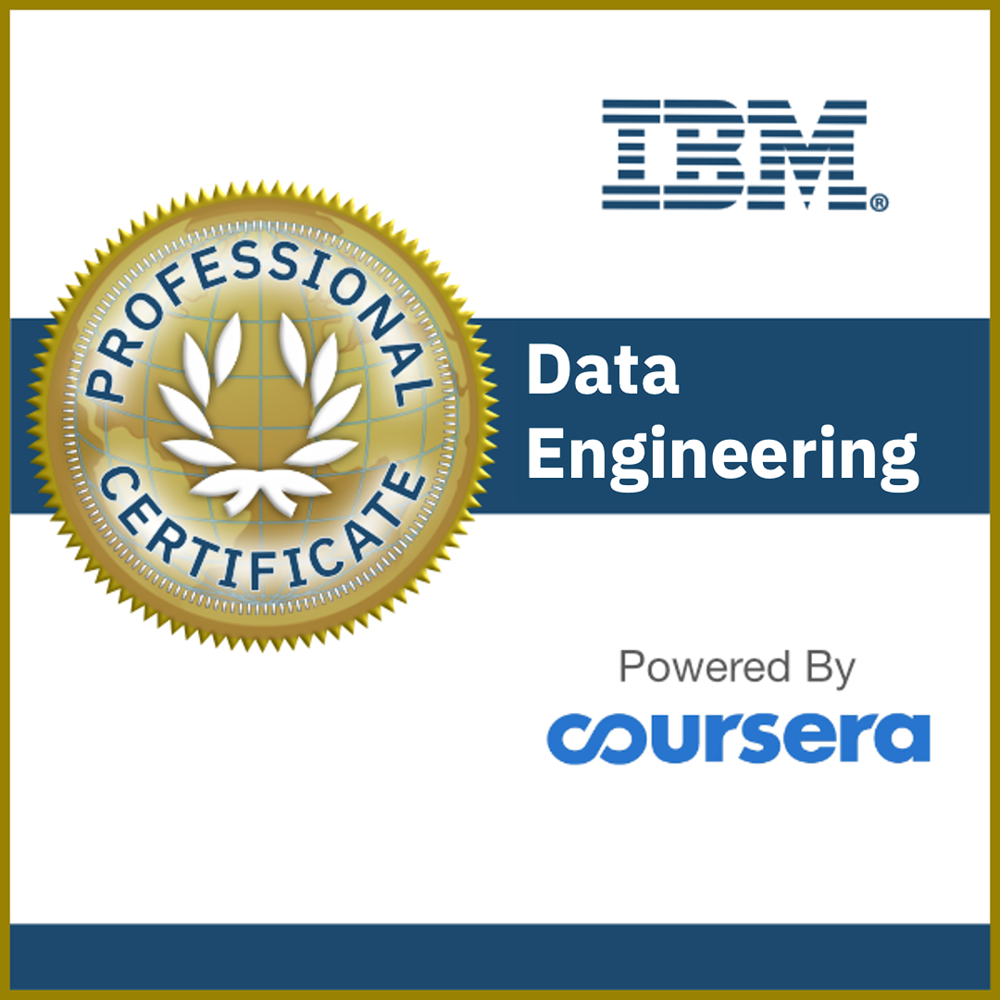
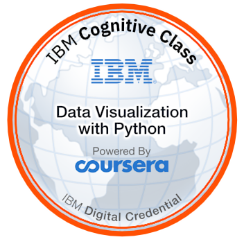
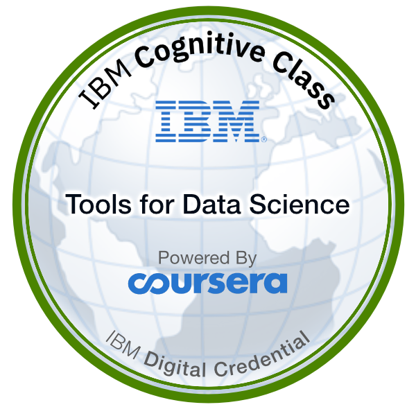
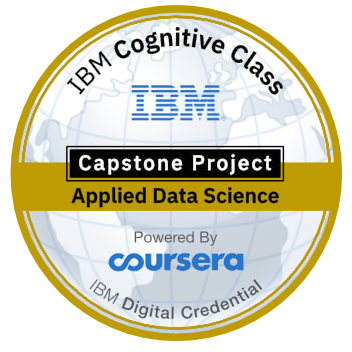
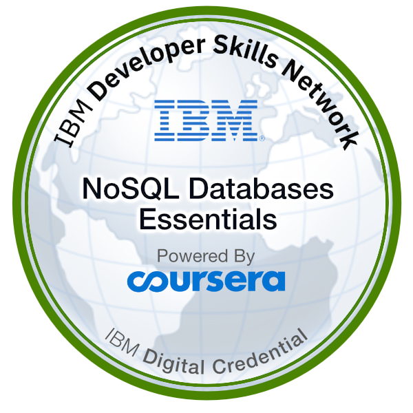

### Hi there 👋 I'm William Zehao Qian
🎉 Welcome to my GitHub profile!  
🔭 I’m currently a student studying Data Science. 

### You may know more about me by visiting my [personal homepage](https://william-zehao-qian.me).

### Languages and Tools:

<!-- ### My GitHub Contributions

 -->

### My GitHub Stats

 

### My Honors
<!--  -->

<iframe name="acclaim-badge" allowtransparency="true" frameborder="0" id="embedded-badge-5bea8f56-7e02-4238-8a90-c0f097139e49" scrolling="no" src="//www.credly.com/embedded_badge/5bea8f56-7e02-4238-8a90-c0f097139e49" style="width: 150px; height: 270px;" title="View my verified achievement on Credly."></iframe>
<iframe name="acclaim-badge" allowtransparency="true" frameborder="0" id="embedded-badge-e96e5f75-890b-4e6b-8e87-04ec5d47b81a" scrolling="no" src="//www.credly.com/embedded_badge/e96e5f75-890b-4e6b-8e87-04ec5d47b81a" style="width: 150px; height: 270px;" title="View my verified achievement on Credly."></iframe>
<iframe name="acclaim-badge" allowtransparency="true" frameborder="0" id="embedded-badge-dec30f0c-4618-4e06-9bfe-cc791f3e3a2d" scrolling="no" src="//www.credly.com/embedded_badge/dec30f0c-4618-4e06-9bfe-cc791f3e3a2d" style="width: 150px; height: 270px;" title="View my verified achievement on Credly."></iframe>
<iframe name="acclaim-badge" allowtransparency="true" frameborder="0" id="embedded-badge-9407830a-aaa5-47f1-9745-68dd3a0c3dc6" scrolling="no" src="//www.credly.com/embedded_badge/9407830a-aaa5-47f1-9745-68dd3a0c3dc6" style="width: 150px; height: 270px;" title="View my verified achievement on Credly."></iframe>
<iframe name="acclaim-badge" allowtransparency="true" frameborder="0" id="embedded-badge-5bb16161-6573-4d61-8255-6568d16b7e42" scrolling="no" src="//www.credly.com/embedded_badge/5bb16161-6573-4d61-8255-6568d16b7e42" style="width: 150px; height: 270px;" title="View my verified achievement on Credly."></iframe>
<iframe name="acclaim-badge" allowtransparency="true" frameborder="0" id="embedded-badge-551a1125-41c8-41d7-bb41-103cae7c3f3f" scrolling="no" src="//www.credly.com/embedded_badge/551a1125-41c8-41d7-bb41-103cae7c3f3f" style="width: 150px; height: 270px;" title="View my verified achievement on Credly."></iframe>
<iframe name="acclaim-badge" allowtransparency="true" frameborder="0" id="embedded-badge-8d8c3112-9d1f-4294-9995-8156eb52bf72" scrolling="no" src="//www.credly.com/embedded_badge/8d8c3112-9d1f-4294-9995-8156eb52bf72" style="width: 150px; height: 270px;" title="View my verified achievement on Credly."></iframe>
<iframe name="acclaim-badge" allowtransparency="true" frameborder="0" id="embedded-badge-393a5cf5-5284-47d2-a5be-4d69e3a5a0b3" scrolling="no" src="//www.credly.com/embedded_badge/393a5cf5-5284-47d2-a5be-4d69e3a5a0b3" style="width: 150px; height: 270px;" title="View my verified achievement on Credly."></iframe>
<iframe name="acclaim-badge" allowtransparency="true" frameborder="0" id="embedded-badge-b1441baa-488b-430a-b740-526224a4f565" scrolling="no" src="//www.credly.com/embedded_badge/b1441baa-488b-430a-b740-526224a4f565" style="width: 150px; height: 270px;" title="View my verified achievement on Credly."></iframe>
<iframe name="acclaim-badge" allowtransparency="true" frameborder="0" id="embedded-badge-bed1c7e5-2cee-4b7a-bbc3-7eb2f7528bd1" scrolling="no" src="//www.credly.com/embedded_badge/bed1c7e5-2cee-4b7a-bbc3-7eb2f7528bd1" style="width: 150px; height: 270px;" title="View my verified achievement on Credly."></iframe>
<iframe name="acclaim-badge" allowtransparency="true" frameborder="0" id="embedded-badge-2c1319ed-6e43-455a-877c-a99f640c33aa" scrolling="no" src="//www.credly.com/embedded_badge/2c1319ed-6e43-455a-877c-a99f640c33aa" style="width: 150px; height: 270px;" title="View my verified achievement on Credly."></iframe>
<iframe name="acclaim-badge" allowtransparency="true" frameborder="0" id="embedded-badge-4de13e0c-8b3f-460d-8302-0d0947dfa913" scrolling="no" src="//www.credly.com/embedded_badge/4de13e0c-8b3f-460d-8302-0d0947dfa913" style="width: 150px; height: 270px;" title="View my verified achievement on Credly."></iframe>
<iframe name="acclaim-badge" allowtransparency="true" frameborder="0" id="embedded-badge-4b8ad5f6-2f45-4055-abe6-ef329df81c03" scrolling="no" src="//www.credly.com/embedded_badge/4b8ad5f6-2f45-4055-abe6-ef329df81c03" style="width: 150px; height: 270px;" title="View my verified achievement on Credly."></iframe>
<iframe name="acclaim-badge" allowtransparency="true" frameborder="0" id="embedded-badge-c0b590d1-cdb0-4841-bc65-3984d1431a78" scrolling="no" src="//www.credly.com/embedded_badge/c0b590d1-cdb0-4841-bc65-3984d1431a78" style="width: 150px; height: 270px;" title="View my verified achievement on Credly."></iframe>
<iframe name="acclaim-badge" allowtransparency="true" frameborder="0" id="embedded-badge-20e29cde-e85c-4303-abba-57ade07ec509" scrolling="no" src="//www.credly.com/embedded_badge/20e29cde-e85c-4303-abba-57ade07ec509" style="width: 150px; height: 270px;" title="View my verified achievement on Credly."></iframe>
<iframe name="acclaim-badge" allowtransparency="true" frameborder="0" id="embedded-badge-5b556c5c-223c-4014-92c9-1a165a96e6b6" scrolling="no" src="//www.credly.com/embedded_badge/5b556c5c-223c-4014-92c9-1a165a96e6b6" style="width: 150px; height: 270px;" title="View my verified achievement on Credly."></iframe>
<iframe name="acclaim-badge" allowtransparency="true" frameborder="0" id="embedded-badge-e8d5a747-5f85-497d-8e0c-1da898917c93" scrolling="no" src="//www.credly.com/embedded_badge/e8d5a747-5f85-497d-8e0c-1da898917c93" style="width: 150px; height: 270px;" title="View my verified achievement on Credly."></iframe>
<iframe name="acclaim-badge" allowtransparency="true" frameborder="0" id="embedded-badge-5c62787f-bedd-442a-a4dc-0a8cef8d01fd" scrolling="no" src="//www.credly.com/embedded_badge/5c62787f-bedd-442a-a4dc-0a8cef8d01fd" style="width: 150px; height: 270px;" title="View my verified achievement on Credly."></iframe>
<iframe name="acclaim-badge" allowtransparency="true" frameborder="0" id="embedded-badge-2b8cfcf0-b2ae-44de-a535-07127c02516f" scrolling="no" src="//www.credly.com/embedded_badge/2b8cfcf0-b2ae-44de-a535-07127c02516f" style="width: 150px; height: 270px;" title="View my verified achievement on Credly."></iframe>
<iframe name="acclaim-badge" allowtransparency="true" frameborder="0" id="embedded-badge-96664d95-f9d8-4442-bdbf-b292d696d609" scrolling="no" src="//www.credly.com/embedded_badge/96664d95-f9d8-4442-bdbf-b292d696d609" style="width: 150px; height: 270px;" title="View my verified achievement on Credly."></iframe>
<iframe name="acclaim-badge" allowtransparency="true" frameborder="0" id="embedded-badge-dede63bf-b417-44c5-9305-a1e328e4cc79" scrolling="no" src="//www.credly.com/embedded_badge/dede63bf-b417-44c5-9305-a1e328e4cc79" style="width: 150px; height: 270px;" title="View my verified achievement on Credly."></iframe>
<iframe name="acclaim-badge" allowtransparency="true" frameborder="0" id="embedded-badge-1f0c24d3-4f2a-4135-8d72-4e5f17a0f97e" scrolling="no" src="//www.credly.com/embedded_badge/1f0c24d3-4f2a-4135-8d72-4e5f17a0f97e" style="width: 150px; height: 270px;" title="View my verified achievement on Credly."></iframe>
<iframe name="acclaim-badge" allowtransparency="true" frameborder="0" id="embedded-badge-5f3defa7-db95-45e2-82b9-b07032491a35" scrolling="no" src="//www.credly.com/embedded_badge/5f3defa7-db95-45e2-82b9-b07032491a35" style="width: 150px; height: 270px;" title="View my verified achievement on Credly."></iframe>
<iframe name="acclaim-badge" allowtransparency="true" frameborder="0" id="embedded-badge-b3331c50-a33a-46c2-b03a-5e42117a0e48" scrolling="no" src="//www.credly.com/embedded_badge/b3331c50-a33a-46c2-b03a-5e42117a0e48" style="width: 150px; height: 270px;" title="View my verified achievement on Credly."></iframe>
<iframe name="acclaim-badge" allowtransparency="true" frameborder="0" id="embedded-badge-27574a0f-bd4b-489c-b8bc-62f067363120" scrolling="no" src="//www.credly.com/embedded_badge/27574a0f-bd4b-489c-b8bc-62f067363120" style="width: 150px; height: 270px;" title="View my verified achievement on Credly."></iframe>
<iframe name="acclaim-badge" allowtransparency="true" frameborder="0" id="embedded-badge-2e5b369b-a159-4415-8f59-101975d1731f" scrolling="no" src="//www.credly.com/embedded_badge/2e5b369b-a159-4415-8f59-101975d1731f" style="width: 150px; height: 270px;" title="View my verified achievement on Credly."></iframe>
<iframe name="acclaim-badge" allowtransparency="true" frameborder="0" id="embedded-badge-4fff1044-a5b0-4652-9f76-ff21ed3b690d" scrolling="no" src="//www.credly.com/embedded_badge/4fff1044-a5b0-4652-9f76-ff21ed3b690d" style="width: 150px; height: 270px;" title="View my verified achievement on Credly."></iframe>
<iframe name="acclaim-badge" allowtransparency="true" frameborder="0" id="embedded-badge-a7171f5e-4735-4f35-be2b-fe7bd4ecbfa7" scrolling="no" src="//www.credly.com/embedded_badge/a7171f5e-4735-4f35-be2b-fe7bd4ecbfa7" style="width: 150px; height: 270px;" title="View my verified achievement on Credly."></iframe>

⭐️ From [William Zehao Qian](https://github.com/dukechain2333)
