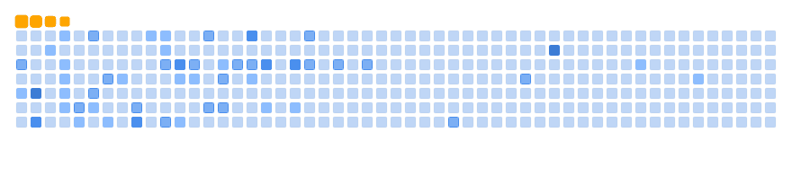
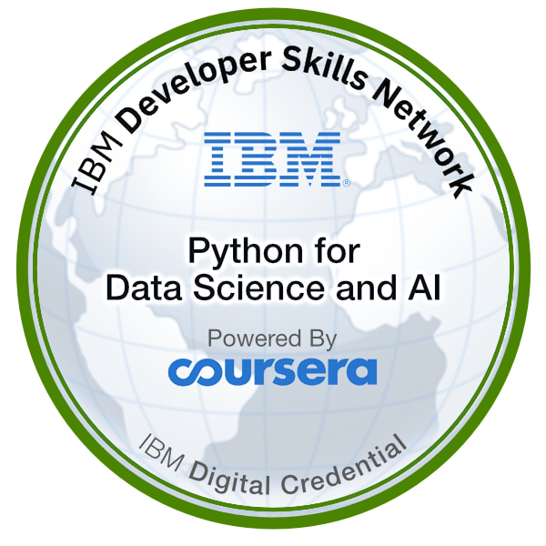
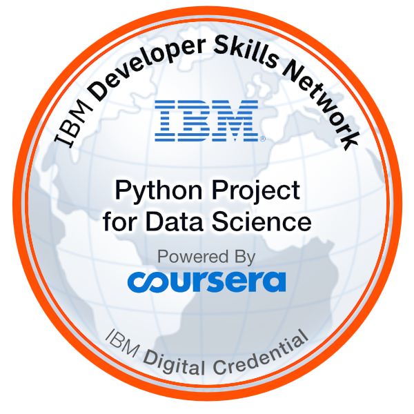
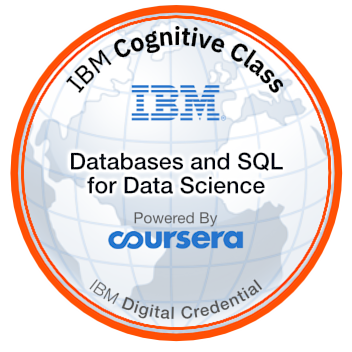
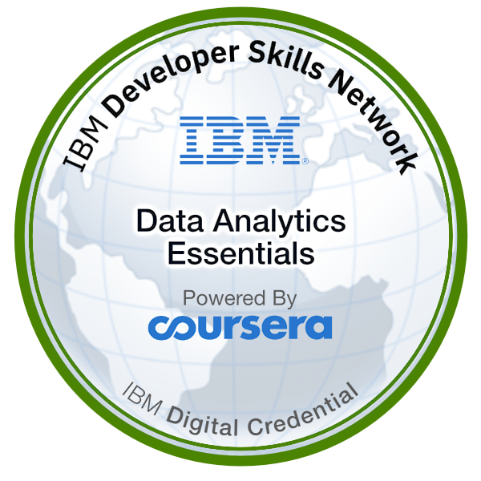
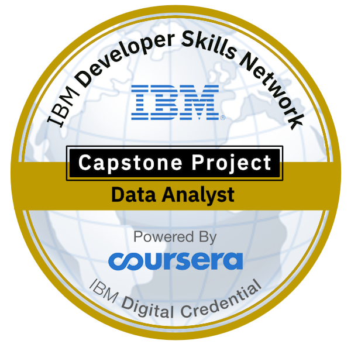
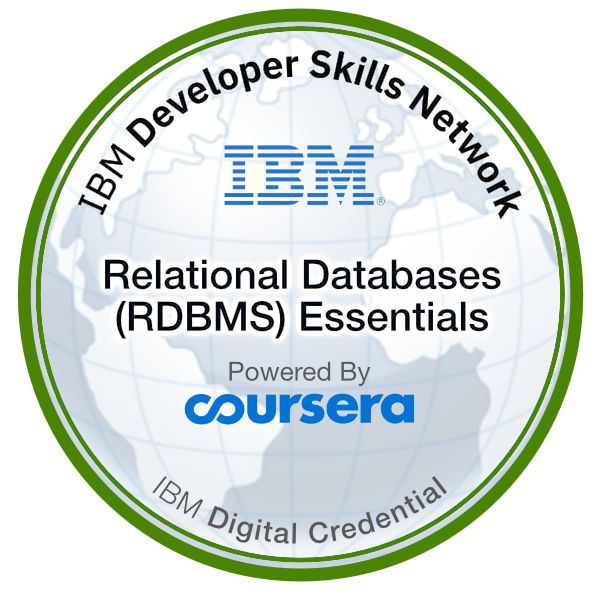
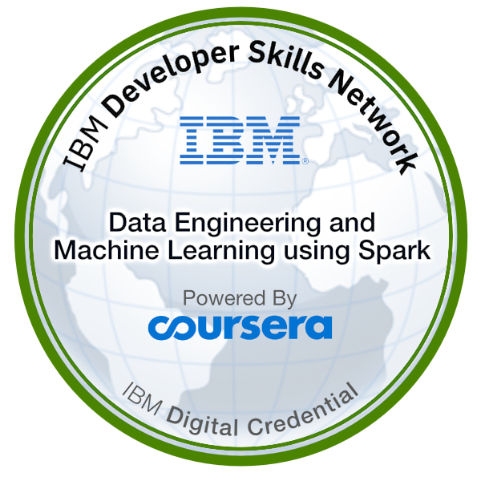

### Hi there 👋 I'm William Qian
🎉 Welcome to my GitHub profile!  
🔭 I’m currently a Ph.D. student in Biostatistics. 

<!-- ### And this is my [LinkedIn](https://www.linkedin.com/in/william-qian-3a97b5245/) page. -->

<!-- ### My GitHub Contributions

 -->

### My GitHub Stats
<picture>
  <source media="(prefers-color-scheme: dark)" srcset="./snakes/github-snake-dark.svg">
  <source media="(prefers-color-scheme: light)" srcset="./snakes/ocean.gif">
  
</picture>

<!-- <picture>
  <source media="(prefers-color-scheme: dark)" srcset="https://github-readme-stats-ruby-one.vercel.app/api?username=dukechain2333&show_icons=true&theme=radical&count_private=true">
  <source media="(prefers-color-scheme: light)" srcset="https://github-readme-stats-ruby-one.vercel.app/api?username=dukechain2333&show_icons=true&count_private=true">
  
</picture> -->

<!-- <picture>
  <source media="(prefers-color-scheme: dark)" srcset="https://github-readme-stats-ruby-one.vercel.app/api/top-langs/?username=dukechain2333&theme=radical&show_icons=true&layout=compact&hide=jupyter_notebook&card_width=250&count_private=true">
  <source media="(prefers-color-scheme: light)" srcset="https://github-readme-stats-ruby-one.vercel.app/api/top-langs/?username=dukechain2333&show_icons=true&layout=compact&hide=jupyter_notebook&card_width=250&count_private=true">
  
</picture> -->

<!--  -->

⭐️ From [William Qian](https://github.com/dukechain2333)
