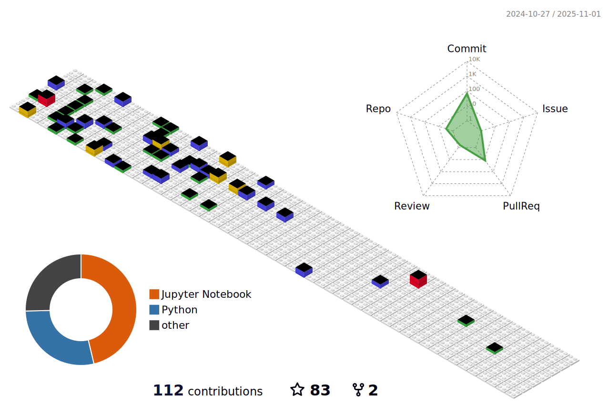
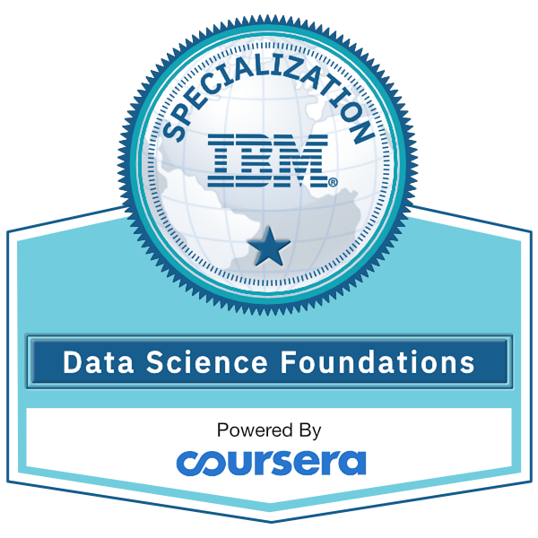
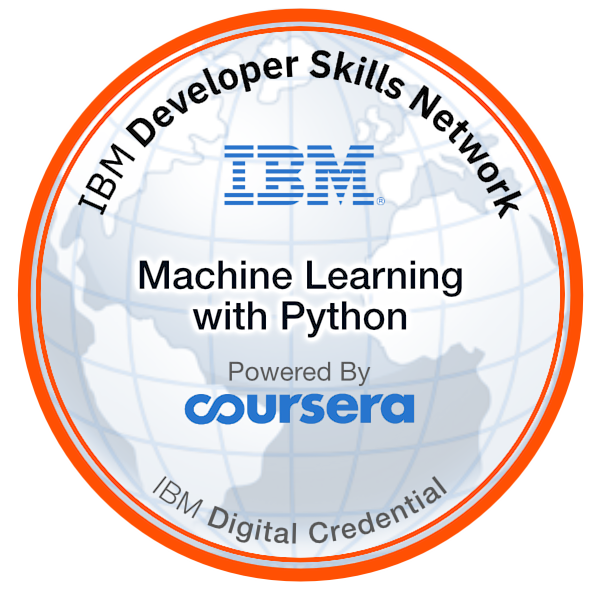
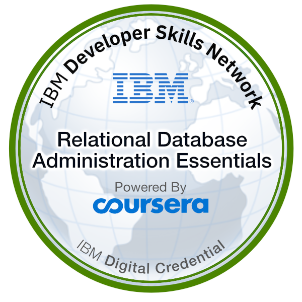

### Hi there 👋 I'm William Zehao Qian
🎉 Welcome to my GitHub profile!  
🔭 I’m currently a student studying Data Science. 

### Languages and Tools:

### My GitHub Contributions

### My Honors

<!-- ### My GitHub Stats

 -->
<!--  -->

⭐️ From [William Zehao Qian](https://github.com/dukechain2333)
