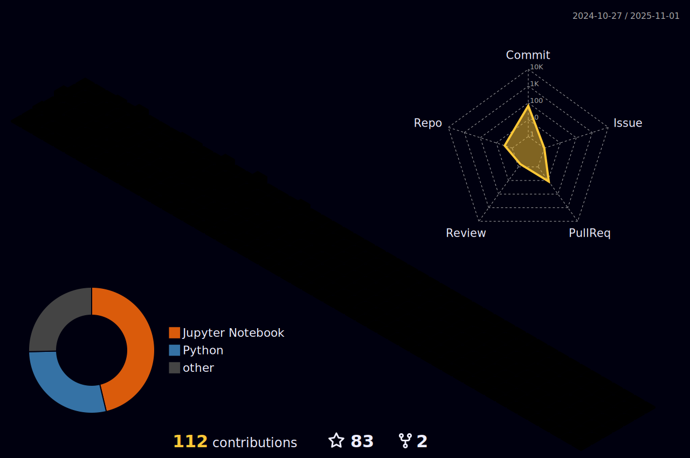

### Hi there 👋 I'm ZHChain
🎉 Welcome to my GitHub profile!  
🔭 I’m currently a student majoring in Data Science. 

### Languages and Tools:

### My GitHub Contributions

<!-- ### My GitHub Stats

 -->
<!--  -->

⭐️ From [ZHChain](https://github.com/dukechain2333)
